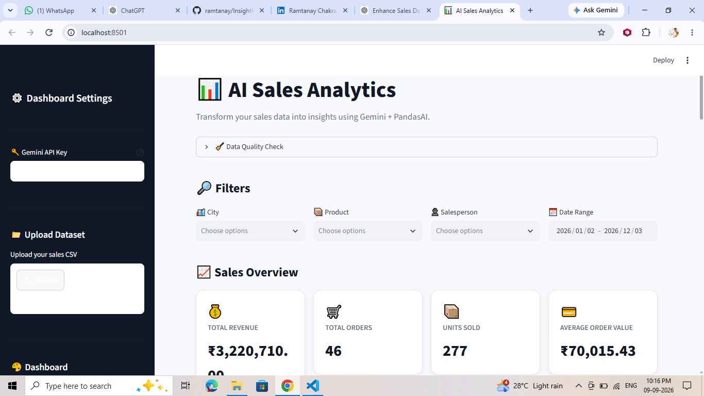
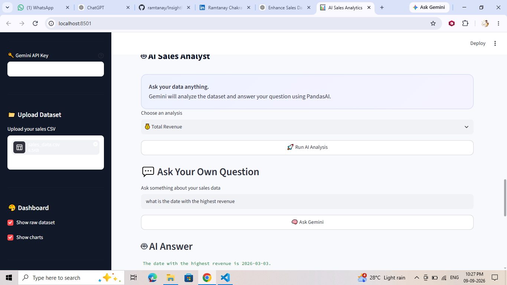
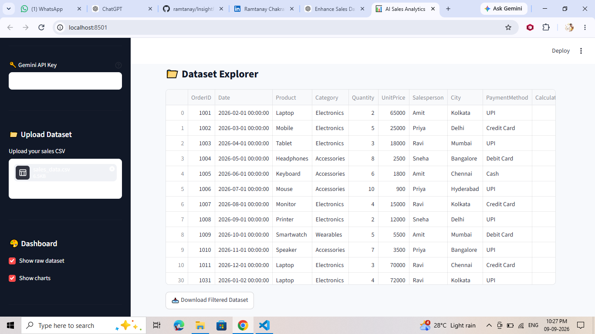

# 📊 AI Sales Analytics Dashboard

An interactive **AI-powered Sales Analytics Dashboard** built with **Streamlit, Pandas, Plotly, PandasAI, and Google Gemini**.

The application allows users to upload or analyze sales data, apply filters, explore interactive visualizations, calculate important business KPIs, and ask questions about their data using natural language.

---

## 🚀 Features

### 📊 Interactive Sales Dashboard
- Total Revenue
- Total Orders
- Units Sold
- Average Order Value (AOV)
- Top-performing products
- Best-performing cities
- Best-performing salespeople

### 🤖 AI Sales Analyst
Ask questions about your sales data using natural language.

Examples:

```text
Which product generated the highest revenue?
Which city sold the most laptops?
Who is the best salesperson?
What are the most important business insights?
Is revenue increasing or decreasing?
```

Powered by:

- Google Gemini
- PandasAI
- LiteLLM

### 📈 Interactive Visualizations

The dashboard automatically creates charts such as:

- Top Products by Revenue
- Revenue by City
- Salesperson Performance
- Revenue Trends

Charts are built using **Plotly**.

### 🔎 Advanced Filtering

Filter your dataset by:

- City
- Product
- Salesperson
- Date range

All KPIs, charts, and AI analysis update based on the filtered data.

### 📁 CSV Upload

Upload your own `.csv` sales dataset directly from the sidebar.

The application also supports loading a default:

```text
sales_data.csv
```

### 🧹 Data Quality Check

The dashboard reports:

- Number of rows
- Number of columns
- Missing values
- Duplicate rows

### 📥 Download Filtered Data

After applying filters, users can download the filtered dataset as a CSV file.

---

# 🏗️ Project Architecture

```text
                    ┌─────────────────────┐
                    │     Sales CSV       │
                    └──────────┬──────────┘
                               │
                               ▼
                    ┌─────────────────────┐
                    │ Data Processing     │
                    │ Pandas              │
                    │ Cleaning            │
                    │ Column Detection    │
                    └──────────┬──────────┘
                               │
                 ┌─────────────┴─────────────┐
                 │                           │
                 ▼                           ▼
        ┌─────────────────┐        ┌──────────────────┐
        │ KPI Dashboard   │        │ Interactive      │
        │                 │        │ Visualizations   │
        │ Revenue         │        │                  │
        │ Orders          │        │ Product          │
        │ Units           │        │ City             │
        │ AOV             │        │ Salesperson      │
        └─────────────────┘        │ Revenue Trend    │
                                   └──────────────────┘
                 │                           │
                 └─────────────┬─────────────┘
                               ▼
                    ┌─────────────────────┐
                    │   PandasAI + LLM    │
                    └──────────┬──────────┘
                               │
                               ▼
                    ┌─────────────────────┐
                    │   Google Gemini     │
                    │ Natural Language AI │
                    └─────────────────────┘
```

---

# 🛠️ Tech Stack

| Technology | Purpose |
|---|---|
| Python | Core programming language |
| Streamlit | Web application and dashboard |
| Pandas | Data processing and analysis |
| Plotly | Interactive visualizations |
| PandasAI | Natural-language data analysis |
| LiteLLM | LLM integration |
| Google Gemini | AI-powered analysis |
| NumPy | Numerical operations |

---

# 📂 Project Structure

```text
AI-Sales-Analytics/
│
├── LICENCE
├── app.py
├── sales_data.csv
├── requirements.txt
└── README.md
```

---

# ⚙️ Installation

## 1. Clone the repository

```bash
git clone https://github.com/yourusername/ai-sales-analytics.git
```

Move into the project directory:

```bash
cd ai-sales-analytics
```

---

## 2. Create a virtual environment

### Windows

```bash
python -m venv venv
venv\Scripts\activate
```

### macOS/Linux

```bash
python3 -m venv venv
source venv/bin/activate
```

---

## 3. Install dependencies

```bash
pip install -r requirements.txt
```

Or install them manually:

```bash
pip install streamlit pandas pandasai pandasai-litellm plotly numpy
```

---

# 🔑 Gemini API Key

The application uses Google Gemini for AI-powered data analysis.

You need a Gemini API key.

When the application starts, enter your API key in:

```text
Sidebar → Gemini API Key
```

The key is entered as a password field and is not displayed openly in the dashboard.

---

# ▶️ Run the Application

Run:

```bash
streamlit run app.py
```

The application will open in your browser.

Usually Streamlit runs at:

```text
http://localhost:8501
```

---

# 📊 Dataset Format

The application can work with common sales-data column names.

A typical dataset can contain:

```text
OrderID
Date
Product
City
Salesperson
Quantity
UnitPrice
```

Example:

| OrderID | Date | Product | City | Salesperson | Quantity | UnitPrice |
|---|---|---|---|---|---:|---:|
| 1001 | 2026-01-01 | Laptop | Kolkata | Rahul | 2 | 55000 |
| 1002 | 2026-01-02 | Mouse | Delhi | Priya | 5 | 800 |
| 1003 | 2026-01-03 | Keyboard | Mumbai | Amit | 3 | 1500 |

Revenue is calculated as:

```text
Revenue = Quantity × UnitPrice
```

If a `Revenue` column already exists, the application can use that value.

---

# 🧠 How AI Analysis Works

The application converts the regular Pandas DataFrame into a PandasAI DataFrame:

```python
df_ai = pai.DataFrame(filtered_data)
```

The user's question is then sent to PandasAI:

```python
result = df_ai.chat(custom_question)
```

PandasAI uses the configured Gemini model to understand the question and perform analysis on the dataset.

For example:

```text
User:
Which city generated the highest revenue?

        ↓

PandasAI

        ↓

Gemini understands the question

        ↓

Data is analyzed

        ↓

AI returns the answer
```

---

# 💡 Example Questions

You can ask questions such as:

### Revenue

```text
What is the total revenue?
```

```text
What is the average order value?
```

```text
Which month generated the highest revenue?
```

### Products

```text
Which product generated the most revenue?
```

```text
Which product sold the most units?
```

```text
Show me the top 5 products by revenue.
```

### Cities

```text
Which city generated the highest revenue?
```

```text
Which city sold the most laptops?
```

### Salespeople

```text
Who is the best salesperson?
```

```text
Compare revenue generated by each salesperson.
```

### Business Insights

```text
Give me five important insights from this dataset.
```

```text
What are the biggest problems in our sales performance?
```

```text
What business recommendations can you make from this data?
```

---

# 📌 Key Performance Indicators

The dashboard calculates several important sales KPIs.

### Total Revenue

```text
Total Revenue = Σ(Quantity × UnitPrice)
```

### Total Orders

If an `OrderID` column exists:

```text
Total Orders = Number of Unique Order IDs
```

Otherwise:

```text
Total Orders = Number of Rows
```

### Units Sold

```text
Units Sold = Σ Quantity
```

### Average Order Value

```text
AOV = Total Revenue / Total Orders
```

---

# 🎯 Data Analysis Workflow

```text
1. Upload CSV
       ↓
2. Load Data
       ↓
3. Clean Column Names
       ↓
4. Detect Important Columns
       ↓
5. Calculate Revenue
       ↓
6. Check Data Quality
       ↓
7. Apply Filters
       ↓
8. Calculate KPIs
       ↓
9. Generate Charts
       ↓
10. Ask AI Questions
       ↓
11. Receive Business Insights
       ↓
12. Download Filtered Data
```

---

# 📷 Screenshots








---

# 🔐 Security Note

Do not hard-code your Gemini API key inside `app.py`.

Avoid doing this:

```python
api_key = "YOUR_API_KEY"
```

Instead, enter the key through the Streamlit sidebar.

For production deployment, environment variables or Streamlit secrets should be used.

Example:

```toml
GEMINI_API_KEY = "your_api_key"
```

---

# 🚀 Future Improvements

Possible improvements for future versions:

- [ ] AI-generated executive summary
- [ ] Automatic anomaly detection
- [ ] Sales forecasting
- [ ] Monthly/yearly comparison
- [ ] Customer segmentation
- [ ] Profit and margin analysis
- [ ] AI-generated recommendations
- [ ] Conversational chat history
- [ ] Automatic chart generation from questions
- [ ] PDF report generation
- [ ] Excel report export
- [ ] Multiple dataset support
- [ ] User authentication
- [ ] Dark/light theme
- [ ] Deployment on Streamlit Cloud

---

# 🌐 Deployment

The application can be deployed using platforms such as:

- Streamlit Community Cloud
- Render
- Railway
- Hugging Face Spaces

For Streamlit deployment, make sure the repository contains:

```text
app.py
requirements.txt
sales_data.csv
```

If using an API key in deployment, store it using the platform's secrets/environment-variable system instead of committing it to GitHub.

---

# 📄 requirements.txt

A basic `requirements.txt` can contain:

```text
streamlit
pandas
numpy
plotly
pandasai
pandasai-litellm
```

---

# 🎓 Skills Demonstrated

This project demonstrates practical knowledge of:

- Python
- Pandas
- Data Cleaning
- Exploratory Data Analysis
- Data Visualization
- Business Intelligence
- KPI Development
- Streamlit
- Plotly
- Generative AI
- Large Language Models
- PandasAI
- Natural Language Data Analysis
- API Integration
- Dashboard Development

---

# 💼 Resume Description

You can describe this project on your resume as:

> **AI Sales Analytics Dashboard** — Developed an interactive Streamlit dashboard using Python, Pandas, Plotly, PandasAI, and Google Gemini to analyze sales data through natural-language queries. Implemented dynamic KPIs, multi-dimensional filtering, interactive visualizations, data-quality checks, automated revenue calculations, and AI-powered business insights.

---

# ⭐ Project Highlights

```text
📊 Interactive Sales Dashboard
🤖 Gemini-Powered AI Analysis
📈 Dynamic Plotly Visualizations
🔎 Multi-dimensional Filtering
🧹 Data Quality Monitoring
📁 CSV Upload
📥 Filtered Data Export
💡 Natural Language Business Insights
```

---

# 👨‍💻 Author

**Ramtanay Chakraborty**

🎓 Computer Science & Engineering Graduate
💻 Python | SQL | Data Analytics | Machine Learning | Generative AI
📊 Interested in building data-driven applications and AI-powered solutions.

This project was built using **Python, Streamlit, Pandas, Plotly, PandasAI, and Google Gemini**.

### 🔗 Connect With Me

* 💼 LinkedIn: **[Ramtanay Chakraborty](#)**
* 🐙 GitHub: **[Ramtanay Chakraborty](#)**
* 📧 Email: **[ramtanayc@gmail.com](#)**

---

⭐ If you found this project useful, consider giving the repository a star!

---

## ⭐ If you found this project useful

Give the repository a ⭐ on GitHub and feel free to improve the project with additional AI-powered analytics features.
